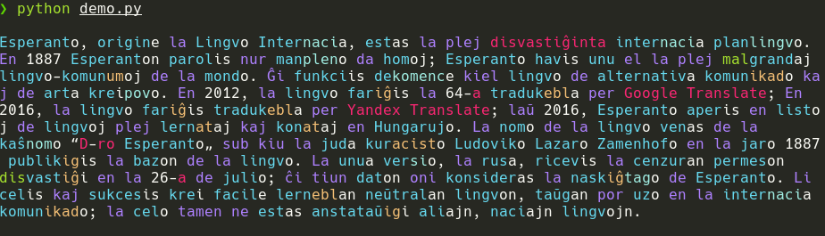

# EOParser

|                                     |
|--------------------------------------------------------------|
| EOParser parsing an article from Vikipedio                   |

## What is it?

`EOParser` is a python library that decomposes Esperanto words into it's particles. This is possible soly due to Esperanto's regular grammar! For example, the word "malsanulo" (sick person) will be decomposed into `mal` (opposite of), `san` (health), `ul` (suffix for a person) and `o` (marking it as a noun).

## Really, what is it?

Techincally `EOParser` is a handwritten GLL parser and disambiguator with a big list of poiible prefixes, suffixes, roots, etc... It uses the LL parser to parse words into it's particles.

## Limitations

EOParser is a word-level analyser. It does not care about the overall grammar and context of a sentence. Hence it may not disambiguate gwords correctly in some cases.

## How to use

```python
>>> import eoparser
>>> parser = eoparser.eoparser()
>>> parser.parse('geparto') # English: parent
[['ge', 'prefix'], ['part', 'root']]
```

The `eoparser.parse` method return a list of lists. Storing the particles and their in type order. In the example, `geparto` is decomposed into `ge` (the prefix for both sexes), `part` (the word root for parent) and the part-of-speech marker is omited. Meaning both father and mother.

Use the `keep_ending_marker` if you wish to keep the `-o` part of speech marker. 

```python
>>> parser.parse('geparto', keep_ending_marker=True)
[['ge', 'prefix'], ['part', 'root'], ['o', 'pos_marker']]
```

This is the list of particle types

| Types                      |
|----------------------------|
| root                       |
| pos_marker                 |
| suffix                     |
| prefix                     |
| word (special single word) |

### Using a different dictionary

EOParser uses severial dictionaries to track which particles are which. By default it loads from wherever the library lives.

```python
parser = eoparser.eoparser(numbers="my_list_of_numbers.txt")
# Or
my_list_of_numbers = load_numbers()
parser = eoparser.eoparser(numbers=list(my_list_of_numbers))
```

| Parameter  |
|------------|
| numbers    |
| prefixes   |
| suffixes   |
| roots      |
| full_words |
|correlatives|

## Contribution

EOParser is by no means perfect! Feel free to submit an issue, open a PR or anything!

